# SS&3CDemo — Phase A～H 总纲

> 汇总自项目对话记录（`G:\资料\SS&3CDemo_Cursor记录`）、`.cursor/plans` 计划文档与当前工程进度。  
> 最后更新：2026-06-05

---

## 项目定位（一句话）

带状态同步的第三人称角色对战/生存小样：把 **Character + Control** 做深，再把 **State Sync + AI** 做成能讲清楚、能演示的技术闭环。

---

## 阶段总览

| Phase | 名称 | 核心目标 | 状态（截至 2026-06） |
|-------|------|----------|----------------------|
| **A** | 骨架拆分 | Context + Intent + Motor，Controller 做编排 | 已完成 |
| **B** | 移动三态 | Idle / Move / Sprint FSM | 已完成 |
| **C** | 战斗 FSM | Attack / Dodge / Hit / Dead + 打断规则（C+） | 已完成 |
| **D** | 同步闭环 | 快照 + 事件 + 插值；D1 假网络 → D2 Mirror | 已完成 |
| **E** | 服务器权威 AI | BT → Intent → 同一套 FSM + 网络同步 | 已完成（E0 后置） |
| **F** | 角色动画表现 | 七种动作 Animator + 双端表现一致 | **进行中**（玩家已验收，NPC 待办） |
| **G0** | 战斗判定（G 前置） | 攻击碰撞掉血、格挡招架、Server 权威伤害 | 未开始 |
| **G** | 战斗手感打磨 | 连段、受击反馈、镜头、VFX/SFX | 未开始 |
| **H** | 内容化生产 | 多角色模板、技能表、关卡波次 | 未开始 |

```mermaid
flowchart LR
  A[PhaseA_骨架] --> B[PhaseB_移动]
  B --> C[PhaseC_战斗FSM]
  C --> Cplus[Cplus_打断表]
  Cplus --> D[PhaseD_同步]
  D --> D1[D1_假网络]
  D1 --> D2[D2_Mirror]
  D2 --> E[PhaseE_AI权威]
  E --> F[PhaseF_动画表现]
  F --> G0[PhaseG0_战斗判定]
  G0 --> G[PhaseG_手感打磨]
  G --> H[PhaseH_内容量产]
```



---

## Phase A — 可扩展骨架

**目标**：把「能跑的单脚本」拆成可扩展三层，移动手感不退化。

| 交付物 | 说明 |
|--------|------|
| `CharacterContext` | 角色运行时上下文（位置、速度、朝向等） |
| `CharacterIntent` | 每帧输入意图（Move、Sprint、Attack 等语义） |
| `CharacterMotor` | 运动执行（加速、转向、位移） |
| `PlayerController` | 瘦编排器：采样输入 → 组 Intent → 驱动 Motor/FSM |

**验收**：移动/转向/跳跃手感与拆分前一致；结构可扩展新动作。

**记录文件**：[`cursor_phasea_d1.md`](cursor_phasea_d1.md)

---

## Phase B — 移动状态机

**目标**：接上 `Idle / Move / Sprint` 三态 FSM + 转移规则。

| 交付物 | 说明 |
|--------|------|
| `IdleState` / `MoveState` / `SprintState` | 三态实现 `CharacterStateId` |
| `CharacterStateMachine` | 状态注册、切换、Tick |
| 转移 | 各状态内根据 Intent 转移（后可选抽成邻接表 C+） |

**验收**：走、停、冲刺切换干净；HUD 中 `StateId` 正确。

---

## Phase C — 战斗状态机

**目标**：接入 Attack / Dodge / Hit / Dead，打断与输入语义。

| 交付物 | 说明 |
|--------|------|
| 四战斗态 | `AttackState`、`DodgeState`、`HitState`、`DeadState` |
| 输入语义 | Attack/Dodge 边沿触发；Sprint 按住态 |
| 窗口 | Attack 时长；Dodge 无敌窗；Hit 硬直；Dead 停 Motor |
| `ApplyHit` | 最小受击入口（初期可调试键） |
| **C+** | `CharacterTransitionMap` + 打断优先级表 + `CharacterStateRuntime` 窗口 |

**验收**：Idle/Move/Sprint → Attack/Dodge；F 键受击；血条归零进 Dead；`StateId` 符合预期。

---

## Phase D — 同步最小闭环

**目标**：本地 FSM 闭环变成可同步、可回放、可纠错的网络闭环。

### D1 — 本地假网络

| 交付物 | 说明 |
|--------|------|
| `StateSnapshot` | 位置、Yaw、VelocityXZ、StateId（后扩展 phase 字段） |
| `ActionEvent` | 离散动作事件（AttackStart、DodgeStart、Hit、Dead…） |
| `LocalSyncPublisher` | 权威端发布快照/事件 |
| `RemoteSnapshotBuffer` + `RemoteInterpolator` | 缓冲 + 插值 |
| `RemoteActionApplier` | 事件落地（seq 去重） |
| `FakeNetworkPipe` | 可配置延迟/抖动/丢包 |

**验收**：假网络下双端位姿与状态一致；抖动可接受。

### D2 — 真实网络（Mirror）

| 交付物 | 说明 |
|--------|------|
| 传输抽象 | Fake / Mirror 可切换 |
| `MirrorSyncTransport` | `BroadcastSnapshotFromServer` / `BroadcastActionFromServer` |
| 输入权威 | `PlayerAuthorityGate`；本地玩家发布，远端只表现 |

**验收**：Host + Client 玩家同步链路可用。

**记录文件**：[`cursor_phasea_d1.md`](cursor_phasea_d1.md)（含 D1）、[`cursor_phased2.md`](cursor_phased2.md)（D2）

---

## Phase E — 服务器权威 AI

**目标**：NPC 完全由 Server 决策，Client 只吃网络数据做表现，多客户端一致。

### 子任务

| 编号 | 内容 | 说明 |
|------|------|------|
| E-Day0 | `RemoteGhost` 收尾 | 不单独开 D2.5，并入 E 首日 |
| E1/E6 | 发布器读真实 FSM | `NpcAuthoritySyncPublisher` 发真实 `CurrentStateId` |
| E2 | BT → Intent → FSM | Behaviour Designer + `NpcAiIntentSource` + NavMesh |
| E0 | 三段 BT 示范 | **后置**，不阻塞 E 结项 |
| 权威 | 仅 Server 跑 AI | `NpcServerAiGate` 关 Client 仿真 |

### 四条通过线（验收）

1. **权威在 Server**：BT/寻路/状态推进只在 Server。
2. **协议复用**：NPC 走同一套 `StateSnapshot` + `ActionEvent`，不另起协议。
3. **双端可验证**：同一只 NPC 移动与关键事件不矛盾、不乱序。
4. **可扩展**：加第二只 NPC 不重写传输层。

**与 Phase F 边界**：E 不追求动画成品级，只要求状态与位置在网战意义下正确。

**记录文件**：[`cursor_phasee1.md`](cursor_phasee1.md)、[`cursor_phasee2.md`](cursor_phasee2.md)

---

## Phase F — 角色动画表现

**定义**：把已同步的 `StateId`、`VelocityXZ`、`ActionType` 映射到 Animator。  
**原则**：逻辑 FSM 为唯一真相；Presenter 用 `CrossFade`/`Play` 驱动 Animator，Controller 内少连线。

### 资产与架构

| 项 | 说明 |
|----|------|
| 模型 | Player/NPC 换 ARPGSamurai 人形 + Avatar |
| Animator | 多 Layer + Mask；Locomotion 2D 融合树（`VelocityX`/`VelocityZ`） |
| 调度 | `CharacterLateUpdatePipeline`（兼 PresentationHost 职责） |
| Presenter | `CharacterLocomotionPresenter`、`CharacterSprintPresenter`、`CharacterCombatPresenter` |
| 网络 | 快照主路径 + `ActionEvent` 边沿；远端与本地同一套 Presenter 规则 |

### 七种动作

| 动作 | StateId / 事件 | 表现要点 |
|------|----------------|----------|
| 移动 | Move / Idle | 未锁定：前向 `VelocityZ`；锁定：八向 `moveInput` |
| 冲刺 | Sprint + `SprintPhase` | Start/Loop/Brake/Turn180 离散态 |
| 攻击 | Attack + `AttackComboStep` | 上半身/全身 CrossFade；combo 1–9 |
| 闪避 | Dodge + `DodgeMode` | 后撤/前滚/锁定八向 |
| 格挡 | Guard + `GuardPhase` | Start/Loop/Exit + GuardWalk |
| 受击 | Hit + `HitVariant` | Reaction 层；轻/重 |
| 死亡 | Dead | Death 层 |

### 战斗表现子路线（F 内顺序）

| 子阶段 | 内容 |
|--------|------|
| 0 | Combat Presenter + Pipeline 战斗路由（Hit/Death 层） |
| 1 | 轻重受击 + Death 细节 |
| 2 | 单向 → 八向 Dodge |
| 3 | 单段/多段 Attack |
| 4 | 锁定 + 八向移动 + 八向翻滚 + 网络同步 |

### Phase F 验收线

- **单机**：七种动作切换时动画正确；脚不滑（Root Motion 与 Motor 不打架）。
- **Host + Client 玩家**：对方七种动作仅依赖快照 + ActionEvent，表现与权威一致。
- **Host + Client NPC**：同上（**当前唯一待办**）。

### 明确不属于 Phase F

- 攻击碰撞判伤、格挡是否挡住 → **Phase G0**
- 连段手感精调、镜头、VFX/SFX 全套 → **Phase G**
- 滑步、TP 相机过渡打磨 → 后置

### 当前进度（2026-06-05）

| 项 | 状态 |
|----|------|
| 玩家七种动作 FSM + Presenter + 快照全字段 | 完成 |
| 锁定八向 + 网络同步 | 完成 |
| 玩家双端验收 | **已验收** |
| Hit 轻/重网络同步 | **已验收** |
| NPC 发布器 + 战斗 FSM + 远端七种动作 | **待办** |

**记录文件**：[`cursor_phasef.md`](cursor_phasef.md)  
**计划文件**：`C:\Users\1941\.cursor\plans\phase_f_角色表现_12da7c19.plan.md`、`phase_f_剩余清单_bcca58a8.plan.md`

---

## Phase G0 — 战斗判定闭环（G 前置）

**目标**：从「调试键假受击」升级为真实战斗闭环；**不阻塞 Phase F 结项**。

| 模块 | 内容 |
|------|------|
| **G0-1 攻击碰撞** | 攻击生效帧 + Hitbox/Hurtbox + `IDamageable` |
| **G0-2 掉血权威** | Server 裁决 → `ApplyHit(damage, isHeavy)` → FSM Hit/Dead |
| **G0-3 格挡交互** | Guard Loop 有效窗 + 朝向扇区；成功减伤/弹刀 vs 破防受击 |
| **G0-4 战斗网络** | 复用 `ActionEvent.Hit` + Param / 快照 `HitVariant`；Client 不本地假扣血 |

**依赖**：Phase F 的 Guard/Hit/Dead 动画已能播；G0 只补判定与权威逻辑。

---

## Phase G — 战斗手感与表现打磨

**目标**：从「能播、能判定」升级到「好玩、有反馈」。

| 方向 | 内容 |
|------|------|
| 连段 | 取消窗口、前后摇、打断规则细化 |
| 受击反馈 | 硬直、击退、镜头震动、音效、VFX |
| 格挡反馈 | 成功/破防差异化表现 |
| 网络观感 | 误差修正更平滑、战斗镜头联动 |

**产出**：至少 1 套可体验的核心战斗循环。

---

## Phase H — 内容化与生产化

**目标**：从样板变成可量产。

| 方向 | 内容 |
|------|------|
| 角色 | 多角色/多 NPC 模板（配置驱动） |
| 战斗 | 技能表、武器表、平衡参数 |
| 关卡 | 波次、敌人组合工具化 |
| AI | 行为树任务库、仇恨/巡逻参数表 |

**产出**：可持续加内容的生产流程，而非每次手写一套。

---

## 建议整体节奏

```
A → B → C(含C+) → D1 → D2 → E(不含E0) → F(玩家✓, NPC待办) → F结项
  → G0(碰撞+格挡+权威伤害) → G(手感) → H(量产)
```

### 时间参考（原计划 6 周容器）

| 阶段 | 原估算 |
|------|--------|
| A | 1–2 天 |
| B | 2–3 天 |
| C | 2–3 天 |
| D | 2 天（D1+D2 可略长） |
| E | 里程碑级（最大） |
| F | 约 1–2 周（含资产） |
| G0 | 2–4 天 |
| G/H | 视范围 |

---

## 相关文件索引

### 对话导出（本目录）

| 文件 | 覆盖 |
|------|------|
| `cursor_phasea_d1.md` | Phase A～D1 |
| `cursor_phased2.md` | D2、F/G/H 首次定义 |
| `cursor_phasee1.md` | Phase E 清单与 F/G/H 展开 |
| `cursor_phasee2.md` | Phase E 收口 |
| `cursor_phasef.md` | Phase F 全量推进记录 |
| **`PhaseA-H_大纲.md`** | 本文档 |

### 计划文档（`.cursor/plans`）

| 文件 | 内容 |
|------|------|
| `phase_f_角色表现_12da7c19.plan.md` | Phase F 主计划 |
| `phase_f_剩余清单_bcca58a8.plan.md` | F 剩余 + G0 划分 |
| `combat_animation_roadmap_467cce38.plan.md` | F 内战斗表现子阶段 0–4 |
| `6周demo进度评估_cd6e8208.plan.md` | 整体进度对照 |
| `phasee开工清单_79024e3d.plan.md` | Phase E 任务拆条 |

### 工程关键路径

```
Assets/Scripts/Character/
  Controller/PlayerController.cs
  Motor/CharacterMotor.cs
  StateMachine/
  Presentation/          # Locomotion / Sprint / Combat Presenter
  Sync/                  # Snapshot, Pipeline, LocalSyncPublisher
  LockOn/
Assets/Scripts/AI/
  NpcCharacterDriver.cs
  NpcAuthoritySyncPublisher（在 Sync/）
Assets/Animations/CharacterAnimator.controller
Assets/Prefabs/Characters/Player.prefab, NPC.prefab
```

---

## 一句话答辩版

> 我们用 A–C 搭好可打断的角色 FSM，D 做成快照+事件的同步闭环，E 让 NPC 在 Server 权威下共用同一协议，F 把七种动作接到 Animator 并保证双端表现一致；战斗判伤与格挡放在 G0，手感和量产放在 G/H。
